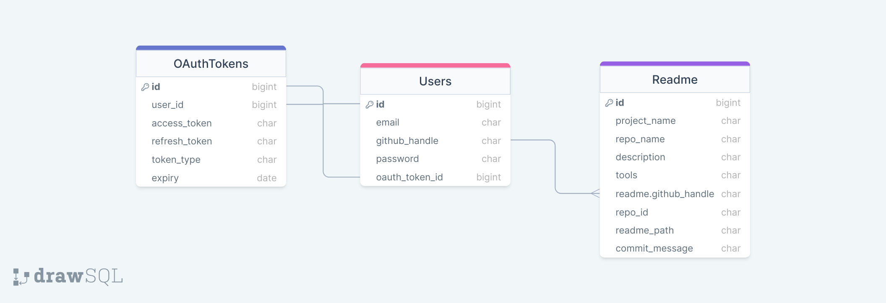
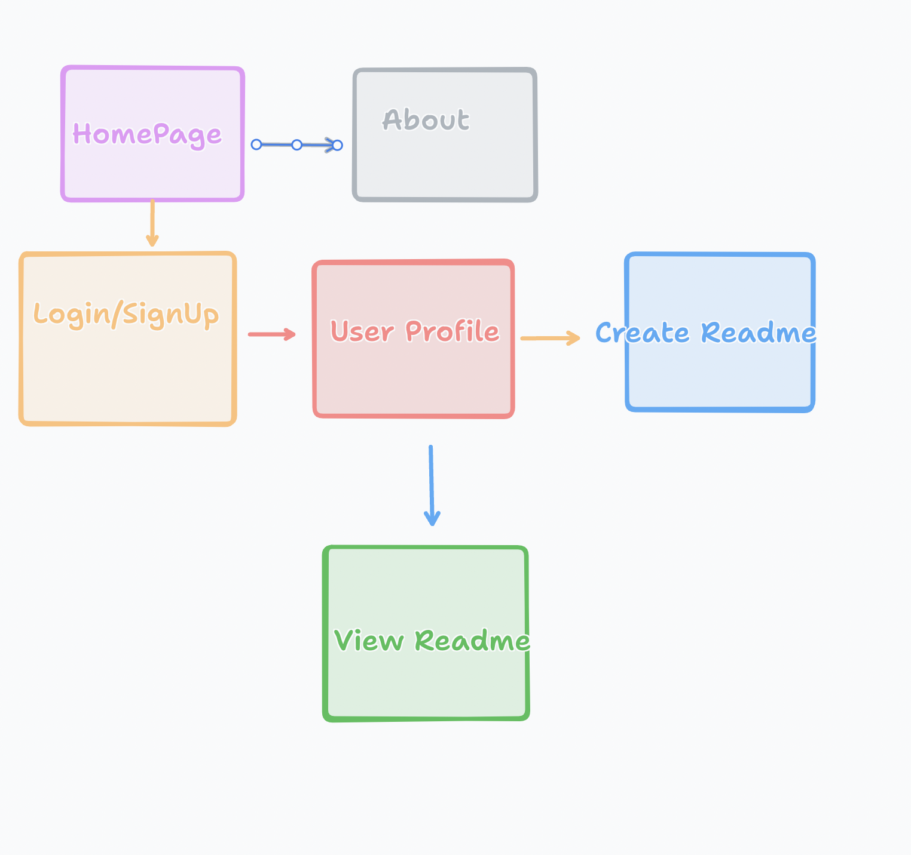

To do

1. Connect Form update, delete readme
2. Click on button navigate to readme
3. Protected routes
4. Update badges -> (The most important GitHub README badges to include depend on the nature of your project and what aspects you want to highlight. However, certain badges are commonly regarded as valuable across many types of projects. Here are some of the most important ones:

5. **Build Status**: Indicates whether the latest build passed or failed. This is crucial for projects that incorporate continuous integration (CI).
   - Example: ``

6. **Code Coverage**: Shows the percentage of the codebase covered by tests. High coverage can indicate a well-tested project.
   - Example: ``

7. **License**: Informs users about the legal permissions and restrictions for your code.
   - Example: ``

8. **Version**: If your project is published as a package (like an npm package), a version badge shows the current release version.
   - Example: ``

9.  **Dependencies Status**: Indicates the status of dependencies, useful for projects with several dependencies.
   - Example: ``

10. **Language Counts**: Shows the number of languages used in the project.
   - Example: ``

11. **Open Issues/PRs**: Displays the number of open issues and pull requests, which can help indicate the activity and community engagement of the project.
   - Example: ``

12. **Last Commit**: Shows when the last commit was made, indicating the project's activity.
   - Example: ``

13. **Downloads**: For projects with distributions, showing the number of downloads can illustrate popularity or usage.
   - Example: ``

14. **Social**: Stars, forks, and watchers badges can be used to display the project's popularity on GitHub.
    - Example: ``

Remember to replace `username`, `repo`, `package_name`, etc., with your actual GitHub username, repository name, or package name. The badges should reflect the actual data of your project, and the URLs should be properly constructed according to the service you are using (e.g., Travis CI, Codecov, npm). Also, ensure that these badges link to the relevant pages (like the build details, license file, etc.) for users who might want to explore them further.)
5. Add diagrams, sql to all readme (Model Name: The name of the model.

Fields: The fields in the model, including their names and data types (e.g., CharField, IntegerField, ForeignKey, etc.).

Relationships: The relationships between models, such as One-to-One, One-to-Many, or Many-to-Many relationships. For ForeignKeys and ManyToManyFields, indicate the related model.

Constraints and Indexes (if any): Such as unique constraints, index fields, etc.
)
6. Research github api
7. Research saving images to a project/github -> https://api.imgbb.com/
8. Research github actions
9.  Research AWS deployments

